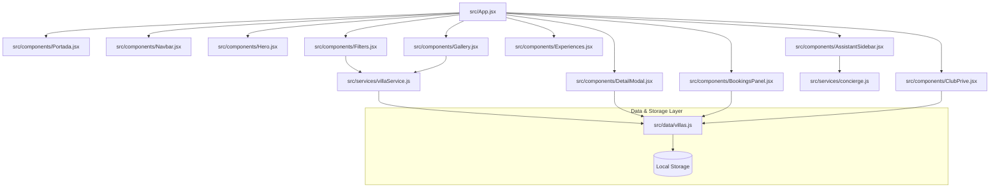

# Luxuria — Colección de Villas de Ultra Lujo

Luxuria es una aplicación web SPA premium diseñada para una agencia exclusiva de alquiler de villas de lujo. Ofrece una experiencia inmersiva, interactiva y de alto impacto visual mediante un diseño sofisticado, animaciones coreografiadas por scroll y un asistente de conserjería virtual inteligente.

El proyecto está localizado al **100% en español por defecto**, con soporte dinámico para múltiples idiomas y divisas.

---

## ⚡ Superpoderes Integrados (Simulación MCP)

Inspirado en la potencia del ecosistema de servidores **Model Context Protocol (MCP)**, hemos dotado a Luxuria de "superpoderes" interactivos que simulan la integración de servicios de APIs externas en tiempo real:

1. **Clima Dinámico (Weather Service - `src/services/weatherService.js`):**
   - **Previsión en Tiempo Real:** Muestra un badge con el estado meteorológico actual y la temperatura directamente sobre la imagen de la villa en la galería (ej: Soleado 24°C en Amalfi, Nevando -2°C en Zermatt).
   - **Pronóstico de 3 Días:** En el modal de detalles, la pestaña *Clima* renderiza una tabla con la previsión a 3 días (temperaturas máximas/mínimas, humedad, viento y condiciones) adaptada geográficamente.

2. **Conversor Multidivisa (Currency Service - `src/services/currencyService.js`):**
   - **Conversión Instantánea:** Un selector en la barra de navegación permite cambiar el formato monetario de todo el sitio entre Euros (**EUR** €), Dólares (**USD** $), Libras (**GBP** £) y Yenes (**JPY** ¥).
   - **Formateo Localizado:** Modifica los importes de forma coherente en la Galería, en los Detallados del Modal y en el Historial de Reservas aplicando el estándar numérico y símbolo del país correspondiente.

3. **Geolocalización y Mapas (Location/Maps Service):**
   - **Minimapa Vectorial:** La pestaña *Ubicación* en el modal de detalles renderiza un mapa visual minimalista del terreno con pines geográficos basados en las coordenadas reales de cada villa.
   - **Coordenadas Precisas:** Muestra la latitud y longitud oficiales del destino.

4. **Calculadora de Traslados VIP (Google Maps MCP - `src/components/DetailModal.jsx`):**
   - **Cálculo de Distancias y Tiempos:** La pestaña *Traslados* calcula las rutas desde aeropuertos o puertos cercanos a la villa, determinando la distancia exacta (en km) y la duración estimada.
   - **Tarifas por Vehículo:** Permite elegir entre Helicóptero VIP, Yacht de Lujo y Limusina blindada, calculando el coste estimado del transfer en la moneda activa.

5. **Historial de Hitos de Obra y Planos (GitHub/GitLab MCP - `src/components/Blueprints.jsx`):**
   - **Blueprints Vectoriales:** La pestaña *Planos* carga un plano técnico de arquitectura renderizado con SVGs dinámicos sobre una cuadrícula azul de ingeniería.
   - **Construcción Commit Log:** Muestra una línea de tiempo (historial de commits de obra) con los últimos hitos estructurales realizados en la villa (ej: "Refuerzo del voladizo de la piscina", "Paneles solares instalados") firmados por el estudio de arquitectura con hash e ID único.

6. **Agenda Cultural y Actividades (Local Events Service):**
   - **Eventos Exclusivos:** La pestaña *Eventos* despliega 3 recomendaciones culturales estacionales específicas para el destino en el idioma seleccionado (ej: Regata de Yates en Amalfi, Festival del Cerezo en Flor en Kyoto, Opening Parties en Ibiza).

7. **Localización e Idioma (Translation Service - `src/services/translationService.js`):**
   - **Soporte Multilingüe:** Permite conmutar dinámicamente toda la interfaz de usuario entre **Español (ES)**, **Inglés (EN)**, **Francés (FR)** y **Japonés (JA)**.
   - **Traducciones Reactivas:** El motor traduce de forma instantánea no solo la interfaz estática (Navbar, filtros, formularios, botones) sino también las descripciones dinámicas de las villas y agendas culturales de eventos.

8. **Ambiente Sensorial (Music/Spotify MCP - `src/components/SoundPlayer.jsx`):**
   - **Reproductor de Audio Analógico:** Pestaña *Sonido* en el modal de la villa que permite reproducir pistas de audio ambiental personalizadas para cada propiedad (ej. *Olas de Amalfi*, *Viento Alpino*, *Lluvia Tropical*).
   - **Visualizador de Espectro:** Ecualizador visual animado por CSS que reacciona con ondas en movimiento al reproducir, control de reproducción de un solo toque y barra de control de volumen arrastrable.

9. **Club Privé VIP (Slack/Telegram MCP - `src/components/ClubPrive.jsx`):**
   - **Canal de Suscripción Off-Market:** Formulario al final de la página que recolecta correo/teléfono de clientes calificados, guarda los datos en Local Storage (`luxuria_club_subscriptions`) y ofrece acceso exclusivo a un canal de mensajería privado para villas exclusivas fuera del catálogo público.

10. **Memoria de Interacción del Conserje (Memory/Graph MCP - `src/components/AssistantSidebar.jsx`):**
    - **Grafo de Memoria de Usuario:** Tarjeta visual en la parte superior del chat de la IA que recopila de forma dinámica los entornos, presupuestos, huéspedes y temas de interés que el usuario ha consultado durante su sesión (ej. *Costa*, *Medio-Alto*, *4 pax*, *Bienestar*).
    - **Adaptación Progresiva:** Permite al asistente ofrecer explicaciones más personalizadas según los intereses "recordados".

---

## 🏗️ Arquitectura y Flujo de Datos

La aplicación sigue el principio de **Separación de Responsabilidades (SoC)** y encapsula la lógica de datos y el motor de recomendación fuera de la interfaz visual.



---

## 📁 Estructura del Proyecto

```bash
luxuria/
├── public/
│   └── images/              # Fotografías premium de villas y portada
│       ├── luxuria_hero.png
│       ├── luxuria_amalfi.png
│       ├── luxuria_alps.png
│       ├── luxuria_bali.png
│       ├── luxuria_desert.png
│       ├── luxuria_kyoto.png
│       └── luxuria_ibiza.png
├── src/
│   ├── components/          # Componentes de presentación (Vistas y Formularios)
│   │   ├── Portada.jsx      # Pantalla de bienvenida y scroll
│   │   ├── Navbar.jsx       # Barra de navegación con selectores de idioma/divisa
│   │   ├── Hero.jsx         # Encabezado editorial principal
│   │   ├── Filters.jsx      # Panel de filtros de búsqueda, precio y huéspedes
│   │   ├── Gallery.jsx      # Bento Grid asimétrica de propiedades con clima
│   │   ├── Experiences.jsx  # Sección de experiencias exclusivas de concierge
│   │   ├── BookingsPanel.jsx# Panel de consultas de reservas guardadas
│   │   ├── DetailModal.jsx  # Ficha interactiva (Pestañas: Detalles, Clima, Mapa, Eventos, Sonido, Traslados, Planos)
│   │   ├── SoundPlayer.jsx  # Reproductor analógico de sonido y ecualizador
│   │   ├── ClubPrive.jsx    # Formulario reflectante de suscripción off-market
│   │   └── AssistantSidebar.jsx # Sidebar del asistente conversacional con memoria
│   ├── data/
│   │   └── villas.js        # Dataset políglota y helpers de Local Storage
│   ├── services/
│   │   ├── villaService.js  # Lógica de filtrado asíncrono
│   │   ├── weatherService.js# Lógica de previsión climática y pronósticos
│   │   ├── currencyService.js# Tasas de cambio y formato localizado
│   │   ├── translationService.js# Diccionarios idiomáticos e interpolación
│   │   └── concierge.js     # Motor NLP del asistente
│   ├── App.css              # Estilos específicos del chat y micro-animaciones
│   ├── App.jsx              # Coordinador de estado e idiomas globales
│   ├── index.css            # Hoja de estilos global y tokens de diseño
│   └── main.jsx             # Montaje de la aplicación
├── index.html               # Configuración del documento y traducción a "es"
├── package.json             # Dependencias
└── vite.config.js           # Configuración del bundler Vite
```

---

## 🛠️ Persistencia en Local Storage

En el módulo [villas.js](src/data/villas.js) se gestionan los datos almacenados en el navegador:
- **Consultas de Reservas (`luxuria_bookings`):** Registra cada reserva realizada por el usuario asociándola a un identificador único `booking_X_Y` con estado inicial "Petición recibida", guardando fechas, nombre e email.
- **Suscripciones Off-Market (`luxuria_club_subscriptions`):** Registra los correos/teléfonos que solicitan unirse al club Privé.
- **Favoritos (`luxuria_favorites`):** Mantiene una lista persistente de los IDs de villas marcadas como favoritas.
- **Historial de Búsquedas (`luxuria_recent_searches`):** Registra los últimos 5 términos de búsqueda ingresados por el usuario utilizando ordenación MRU (Most Recently Used).

---

## 🚀 Instalación y Despliegue

1. **Instalar Dependencias:**
   ```bash
   npm install
   ```

2. **Servidor Local (Desarrollo):**
   ```bash
   npm run dev
   ```
   Abre la dirección `http://localhost:5173` en tu navegador.

3. **Generar Bundle de Producción:**
   ```bash
   npm run build
   ```
   Genera los recursos optimizados en la carpeta `/dist`.
